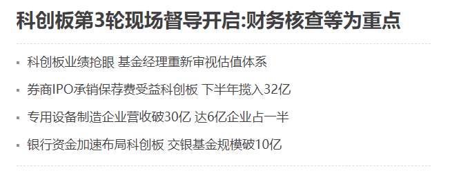
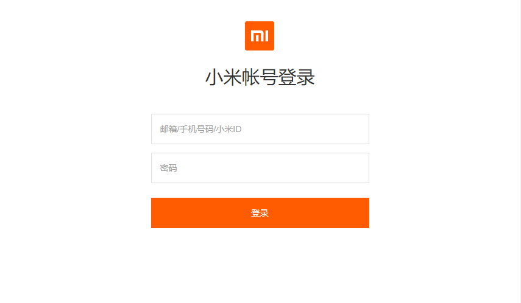
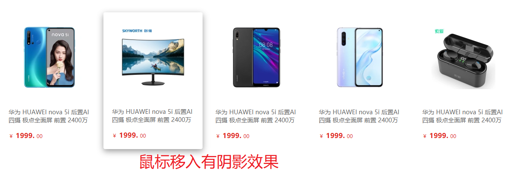

# CSS 第四天

[之前的笔记](before.md)

## 昨日反馈

| 意见或建议                                                   |
| ------------------------------------------------------------ |
| 老师可以发一些静态网页的素材给我们练练手，平时没啥事干想练练速度 |
| 就业班前面的 js 是万少教吗                                   |
| 想问一下万少以后出去工作后要怎么保持不断的学习新知识         |
| 老师真的太棒了！                                             |
| 任务轻松，涉及到的数学问题虽然简单，但还是一脸懵逼当中，不过好在能理解 |
| 没什么意见，我这人怎么样都可以                               |

## 学习目标

1. 掌握**盒子模型**的**边框**、**内间距**、**外边距**的作用及设置方法；
2. 能够说出**外边距合并**问题的现象及解决办法（面试题）。
3. 能够给盒子设置**圆角边框**和阴影，知道怎么给文字添加阴影；
4. 能够说出**浮动的应用场景**和**布局套路**，并应用浮动**完成常见网页布局**案例；

## 盒子模型

### 作用

熟系盒子模型的可以更好的帮我们控制好模块之间的关系 

### 组成部分

1. 内容
2. 内间距
3. 外间距
4. 外间距


### 边框

| 属性         | 作用                                         |
| ------------ | -------------------------------------------- |
| border-width | 边框粗细，单位是 px                          |
| border-style | `solid` 实线 / `dashed` 虚线 / `dotted` 点线 |
| border-color | 边框的颜色                                   |

常用写法:

```css
div {
    border : 1px solid red;
}
```


#### 表格边框

> 以后 想要使用表格的时候 如果想要 合并 重复重叠的边框 

1. 需要给table 标签添加样式

2. 代码 边框合并

   ```css
       table {
         /* 控制边框合并  只对表格生效!!!   */
         border-collapse: collapse;
       }
   ```

   ---

   

   ```html
   <!DOCTYPE html>
   <html lang="en">
   
   <head>
     <meta charset="UTF-8">
     <meta name="viewport" content="width=device-width, initial-scale=1.0">
     <title>Document</title>
     <style>
       td,
       th {
         border: 1px solid #000;
       }
   
       table {
         /* 控制边框合并  */
         border-collapse: collapse;
       }
     </style>
   </head>
   
   <body>
     <table cellspacing="0">
       <thead>
         <tr>
           <th>序号</th>
           <th>姓名</th>
         </tr>
       </thead>
       <tbody>
         <tr>
           <td>0</td>
           <td>悟空</td>
         </tr>
         <tr>
           <td>1</td>
           <td>八戒</td>
         </tr>
       </tbody>
     </table>
   </body>
   
   </html>
   ```

#### div 实现 细边框效果

```html
<!DOCTYPE html>
<html lang="en">
<head>
  <meta charset="UTF-8">
  <meta name="viewport" content="width=device-width, initial-scale=1.0">
  <title>Document</title>
  <style>

    /* 
    需要将 合并的边框 移除掉
    1 对table 合并边框的了解 

    2 需要对哪个标签 
      box 添加 边框合并的代码 
     */
    .box{
      width: 50px;
      /* 边框合并 只对表格生效 */
      /* border-collapse: collapse; */
    }
    .item{
      height: 50px;
      /* border: 1px solid #000; */
      border-left: 1px solid #000;
      border-right: 1px solid #000;
      /* border-bottom: 1px solid #000; */
      border-top: 1px solid #000;
    }
      
.box{
  /* border-top: 1px solid #000; */
  border-bottom: 1px solid #000;
}
  </style>
</head>
<body>
  <div class="box">
    <div class="item">1</div>
    <div class="item">2</div>
    <div class="item">3</div>
  </div>
</body>
</html>
```

#### 边框的增大会影响盒子的大小

```html
<!DOCTYPE html>
<html lang="en">
<head>
  <meta charset="UTF-8">
  <meta name="viewport" content="width=device-width, initial-scale=1.0">
  <title>Document</title>
  <style>
    .box{
      width: 200px;
      height: 200px;
      background-color: aqua;

      /* 
      边框增大的时候 会不会 增大盒子的 宽度 
      会
       */
      border: 10px solid #000;
    }
  </style>
</head>
<body>
  <div class="box"></div>
</body>
</html>
```


### 内边距

> 控制盒子内侧与内容的距离

```css
div {
    padding: 10px;
}
```

| 值的个数                     | 含义                         | 记忆       |
| ---------------------------- | ---------------------------- | ---------- |
| padding: 5px;                | 四周都是 5px                 | 一个管四边 |
| padding: 5px 10px;           | 上下 5px / 左右 10px         | 上下和两边 |
| padding: 5px 10px 20px;      | 上 5px / 左右 10px / 下 20px | 左右放中间 |
| padding: 5px 10px 20px 30px; | 上 / 右 / 下 / 左，顺时针    | 顺势方向圈 |

### 外边距

> 控制盒子与盒子之间的距离

```css
div {
	margin: 10px;
}
```

简写方式和 `padding` 一致

### 元素水平居中

1. 块级元素 使用 `margin : 0  auto;`
2. 行内或者行内块 需要对其父元素 添加 `text-align:center;`

### 外边距合并

两个块级元素 

1. **上面**的盒子 添加 **下外边距**
2. **下面**的盒子 添加 **上外边距** 
3. 最终的效果**不是两个盒子的间距叠加**, 而是 **取两者的最大值**
4. 在写代码的时候 **尽量只使用一个盒子** 添加 一个下边距或者上边距即

### 外边距塌陷

1. 当父子盒子都添加了 `margin-top`的时候, 会出现 父子盒子都往下掉的样子 就类似
   1. 只给父盒子添加了  一个**上外边距**一样。
2. 解决方法:
   1. 给父盒子添加一个 `border`
   2. 给父盒子添加一个 `padding`
   3. 给父盒子添加 `overflow:hidden;` 

## 边框圆角

让矩形出现圆角效果  `border-radius`

1. 正圆使用百分比
2. 长方形 一般都是使用 px单位。

## 阴影

### 盒子阴影

> 让盒子添加阴影效果
>
> 要懂得要利用浏览器中的调试工具 

```css
div {
    box-shadow: 0px 0px 10px 0px red;
}
```

### 文本阴影

```css
    h1 {
      /* 文本 */
      /* 水平偏移 垂直偏移 模糊值 颜色  */
      text-shadow: 0px 0px 0px red;
    }
```

## 案例和作业

<a href="2021年1月22日作业材料.zip" download  >案例素材下载</a>

### 小米导航栏


### 财经新闻



### 小米登录框

登录框需要在网页的居中显示

**素材**




### 产品模块

让产品在**居中**显示


### 产品列表

1. 五个元素都要在网页的中间显示

