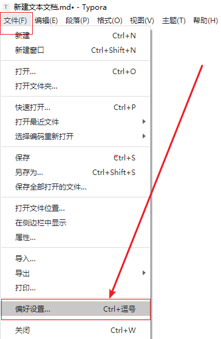
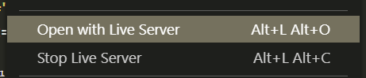

# CSS第二天

[之前的笔记](before.md)

## 昨日反馈

| 意见或建议                                 |
| ------------------------------------------ |
| 老师讲课很帅！时不时可以整点噪音提提神！！ |
| 老师棒棒哒！！！                           |
| 万少的 爆笑虫子 呢                         |

## 学习目标

1. 讲解作业
2. 讲解常用工具
3. 能够使用 **emmet** 语法提高编码速度；
4. 能顾使用**复合选择器**在 HTML 中定位元素；
5. 能够理解元素的**几种显示模式**，并通过代码在不同显示模式间转换

## typora

### 贴图

1. 点击 `文件` -> `偏好设置`

   

2. 设置 复制图片到本地路径

   

   

## 有道词典

### 翻译


1. 打开之后 右键 有点词典小图标  `划词翻译`

   

2.  点击 `设置`  然后按照以下操作即可

   

3.  想要翻译哪个单词  鼠标先选中他们 然后 按两次 `ctrl`

## vs code 

### 插件


### 步骤

1. 以文件夹的方式来打开 `vs code`  否则 插件无法生效

2. 鼠标右键 `html` 文件即可  

   

## emmet 语法

### 作用

提供编写代码的效率

### HTML emmet

| 序号 | 符号                   | 含义                       | 示例                 |
| ---- | ---------------------- | -------------------------- | -------------------- |
| 1    | `*N`                   | **连续**生成 N 个          | `div*5`              |
| 2    | `父>子`                | 生成**父子关系**结构       | `ul>li*5`            |
| 3    | `兄+弟`                | 生成**兄弟关系**结构       | `h1+div*2+h4+p*2`    |
| 4    | `.class` / `#id`       | 生成带 class 或 id 的 div  | `.red` / `#app`      |
| 5    | `tag.class` / `tag#id` | 生成带 class 或 id 的 tag  | `p.red` / `span#nav` |
| 6    | `$*N`                  | `$` 位置会被连续的数字替换 | `.demo$*5`           |
| 7    | `{内容$}`              | 标签内容                   | `p{段落$}*5`         |

### CSS emmet

- **常用属性**大多用**英文单词的首字母**连写即可，示例如下：
- `tac` → `text-align: center;`
- `ti2em` → `text-indent: 2em;`
- `lh26px` → `line-height: 26px;`
- `tdn` → `text-decoration: none;`

## CSS 复合选择器

### 作用

可以让我们更加灵活的来选择目的标签

### 后代选择器 

符号是 `空格`

**css**

```css
div span{
	color: red;
}
```

**html**

> 两个 `span` 标签都会被选中

```html
<div>
    <span>1</span>
    <p>
        <span>2</span>
    </p>
</div>
```

### 子代选择器

符号是 `>`

**css**

```css
div > span {
	color: red;
}
```

**html**

> 第二个 `span`  不会被选中

```html
<div>
    <span>1</span>
    <p>
        <span>2</span>
    </p>
</div>
```

### 并集选择器

> 符号是 逗号  意思两个或者多个选择器 共用一套css代码

```css
.a1,.a2,.a3 {
    color:red;
}
/* 相当于 */ 
.a1{
    color:red; 
}
.a2{
    color:red; 
}
.a3{
    color:red; 
}
```

### 小结

1. 后代选择器的符号 是 **空格**
2. 子代选择器的符号 是 `>`
3. 并集选择器的符号 是 `,`  

### 链接伪类选择器

理解为 和 a标签不同状态下的选择器 

记忆

> love hate  l
>
> l  v h a 

| 链接伪类选择器    | 说明                               |
| ----------------- | ---------------------------------- |
| a:link 少用       | 选择所有未被访问的链接             |
| a:visited  少用   | 选择所有已经被访问的链接           |
| **a:hover**  常用 | **选择鼠标指针位于其上的链接**     |
| a:active 少用     | 选择激活链接（鼠标按下未抬起的链接 |

### focus 伪类选择器

获得鼠标焦点的时候被选中

如 输入框获得光标的时候 可以切换样式

```css
input:focus{
    background-color: yellow;
}
```

### 小结

1. 什么是伪类选择器 

   可以 理解元素的**不同状态**下 才可以被选中的   选择器

   ```
   未被选中  已经选中的  鼠标移入 鼠标按下 鼠标点击-获得焦点的 
   ```

## 元素的显示模式

### 作用

可以帮助我们的对应的位置 可以存放最适合的标签。

### 分类

- 块元素
- 行内元素


### 块元素

> 宽度默认会占据一整行的元素

有:

```html
div h1 p ul ol li table body 
```

**特点**:

1. 宽度 默认 为一行 (等同于父元素的宽度)
2. 可以设置宽度和高度
3. 添加内外间距都会生效
4. 充当 `容器`  使用 
5. `h标签` 和 `p标签` 内部都要再存放  块级元素 !  


### 行内元素

> 也叫内联元素 

```html
span  a  i strong b em .... 
```

**特点**:

1. 一行上可以存放多个
2. 行内元素不应该再存放行内元素
3. 充当页面的点缀 或者 修饰 使用


### 行内块

> 具有了块级和行内的特点

**特点**

1. 默认大小由内容撑开
2. 可以设置宽度和高度
3. 可以在一行上存放多个

### 小结

| 元素模式   | 英文         | 排列方式           | 指定宽高 |
| ---------- | ------------ | ------------------ | -------- |
| 块级元素   | block        | 一行一个           | 可以     |
| 行内元素   | inline       | 一行多个，内容撑开 | 不可以   |
| 行内块元素 | inline-block | 一行多个           | 可以     |


### 元素模式的转换

- `display: block;`  块级
- `display : inline;`  行内
- `display: inline-block;` 行内块


## 作业

### 小米侧边栏

**要求**:

1. 完成布局效果
2. `鼠标` 引入的时候 改变元素的背景颜色和字体颜色


### 对之前的作业 如果有没有完成的 再重写一次

> 我们追求的不只是写出来 更加是要 **熟练**的写出来! 


