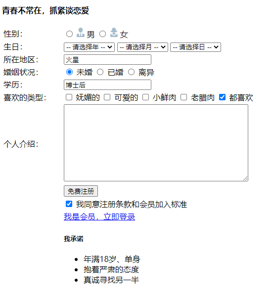
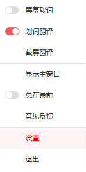
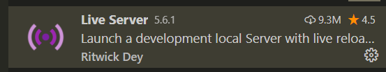

# 基础班

## 基础班完整的上课文档资料

- [内网可以打开](http://192.168.50.25:9077/)
- [外网可以打开](http://157.122.54.189:9077/)

## 上课的模式

1. 主要步骤播放 录制好的视频 
2. 我 万少 随时结合当下给大家做补充 !!! 
3. 万少所补充的重点和视频中 不太一样 
   1. 以 万少的为准!!! 

## 同学们需要做的事 

1. 上课 听课
2. 每一节课 都可以使用 typora 记录下来 重点难点 
3. 随时会有 作业 案例 去敲代码  
4. 晚自习
   1. 学会做一天的总结 (思维导图 xmind)
   2. 复习今天所学知识 +  案例
   3. 往下预习 明天即将要讲解的内容 
5. 在班级的时候 感觉到学习上有困难 自己很难去解决了  寻求别人的帮助 

## 基础班的学习目的

1. 基本目标 能够磕磕碰碰的把网页写完  
2. 更好的目标 熟练的把它写出来   (效率)
3. 精通  长期目标!!! 

# HTML 第一天

## 什么是网页

1. 网站  一堆网页的组成 
2. 网页 其实就是  HTML 文件 
3. HTML 
   1. 超文本标记语言 
   2. 组成元素
      1. 视频
      2. 图片
      3. 超链接
      4. 文字 

## 常用的浏览器内核 -  了解

| 浏览器         | 内核    | 备注                                     |
| -------------- | ------- | ---------------------------------------- |
| IE             | Trident | IE、猎豹安全、360 极速浏览器、百度浏览器 |
| FireFox        | Gecko   | 火狐浏览器内核                           |
| Safari         | Webkit  | 苹果浏览器内核                           |
| Chrome / Opera | Blink   | Blink 其实是 Webkit 的分支               |

## Web 标准

前端三大构成部分  

1. HTML 结构层
2. CSS 样式
3. JavaScript  行为

> 基础班只学习 HTML 和 CSS


## HTML 基本结构标签  (骨架)

补充的文档

```
http://192.168.50.25:9077/html/day01.html#%E2%98%862-html-%E9%AA%A8%E6%9E%B6
```


基本的结构

```html
<!DOCTYPE html>
<html lang="en">
<head>
  <title>Document</title>
</head>
<body>
  hello 
  你好 
</body>
</html> 
```

## 标签语义

[标签名和其含义](https://www.runoob.com/html/html-tag-name.html)

标签的含义  标签到底是做什么使用的

合适的地方存放合适的标签 

### 标题标签

`h1~h6` 标签  表示不同的标题

### 段落标签

`p`  标签

### 换行标签

`br`   它是一个单标签  意思是实现换行 

## 文本格式化标签

让文本显示粗体 倾斜 下划线等

> 能记住就能提高我们写代码的效率 不能记住就去翻阅文档  效率就低一些了

| 标签        | 说明                  |
| ----------- | --------------------- |
| strong 或 b | 加粗，更推荐 `strong` |
| em 或 i     | 倾斜，更推荐 `em`     |
| del 或 s    | 删除线，更推荐 `del`  |
| ins 或 u    | 下划线，更推荐 `ins`  |


### 以后开发 最常用的两个标签!!! 

1. div 标签  会换行(类似 p 标签)
2. span 标签   (不会换行)


## 换行和不换行的标签

### 换行

1. `br`
2. `p`
3. `div`  重要
4. `h1~h6`

### 不换行

1. `span`
2. `i`
3. `u`
4. `s`
5. `b`
6. `strong`
7. `em`
8. `del`
9. `ins`


## 图片标签

负责将一张图片显示在网页中 

1. `img`  图片标签 单标签
2. `src`  要存放图片的地址  
3. `alt`  当图片加载失败的时候 所显示的提示文字
4. `title` 当用户鼠标引入 图片的时候 显示文字

```html
  <!-- 
    1 src 负责填写要显示的图片的 路径-地址  必须要提供
    2 alt 负责给图片加提示使用了  看情况来添加吧 
        当图片显示失败 提示文字才出来 
    3 title  当用户的鼠标移入图片的时候 给别人的提示   看情况来添加吧 

    
   -->
  
  <span>柯南的电影</span>
  
```


### 相对路径和绝对路径

> 重点把握 相对路径即可 绝对路径-了解就可以了

```html
  <!-- 相对路径 -->
  
  <!-- 绝对路径  学习到了 服务器的知识  常用一些  -->
  
```

`在基础班 相对路径更加常用`


```html
  <!-- 
    1 需要先返回上一层
    2 再返回上一层
    3 就能找到 images 文件夹
    4 才能找到它里面的  1.png 

    5 相对路径
      1 是相对于网页自己的位置
      2 ../ 返回上一层的意思!!! 
    
   -->
   <!-- 1 返回上一层 -->
  
  <!-- 2 再返回上一层  返回两层 -->
  
  <!-- 3 就能找到 images 文件夹 -->
  
  <!-- 4 找到image下的图片 -->
  
  
```


## 链接标签

实现跳转功能

1. `a` 为标签名

2. `href`  为要跳转的地址 可以为外网链接 或者 内网链接 或者 `空链接 #`  或者 `锚点`

   1. 锚点

      ```html
      <a href="#ok">早点经历</a>
      
      <h1 id="ok" >
          刘德华的早点经历
      </h1>
      ```

      

3. `target`为打开方式 

   1. `_blank`  以新窗口打开
   2. `self` 将当前网页替换成 新的网页

4. `下载`   基础班少用  了解即可

5. 


## 锚点链接案例

给以下标题添加对应的锚点

```
1. 早年经历<br />
2. 演艺经历<br />
3. 个人生活<br />
4. 主要作品<br />
```


```
<h2>目录</h2>

1. 早年经历<br />
2. 演艺经历<br />
3. 个人生活<br />
4. 主要作品<br />

<h3>早年经历</h3>

刘德华出生于香港新界，在家中排行老四，幼时随家人搬到了九龙钻石山的木屋区居住，并和姐弟一起帮助家里打理卖稀饭的生意[17]
。1973年，刘德华随家人搬入香港蓝田邨第15座14楼[18]<br />
刘德华从黄大仙天主教小学毕业后升读可立中学[19]<br />
在可立中学读书期间，刘德华积极参加校内学校剧社的表演，在老师杜国威的指导下学习戏剧方面的知识。此外，他还参与包括编剧在内的幕后制作。刘德华在中五会考获得1B3D2E（中文读本A）的成绩。中六上学期后，他到香港电视广播有限公司的艺员训练班受训，从而开始了演艺之路[20]<br />

<h3>演艺经历</h3>

1981年，刘德华考进第10期无线电视艺员训练班[21]
；同年，出演个人首部电视剧《江湖再见》，在剧中饰演以贩卖妇女为生的小混混阿龙[22]
；该剧获得美国电视节电视剧特别奖[23] 。<br />
1982年，刘德华以甲级成绩从艺员训练班毕业后正式签约TVB[24]
；同年在喜剧《花艇小英雄》中饰演败家仔钱日添；12月，与叶德娴搭档主演时装警匪剧《猎鹰》，凭借卧底警察江大伟一角获得关注[25]
。<br />
1983年，主演金庸武侠剧《神雕侠侣》，在剧中饰演外貌俊俏、倜傥不羁的杨过[26]
；该剧在香港播出后取得62点的收视纪录；同年，与黄日华、梁朝伟、苗侨伟、汤镇业组成“无线五虎将”[27]
。<br />
1984年，与赵雅芝合作主演古装武侠剧《魔域桃源》，在剧中饰演资质出众、武功高强的傅青云[28]
；同年，与梁朝伟共同主演金庸武侠剧《鹿鼎记》，在剧中饰演英明果断的康熙[29]
。<br />
1985年，在古装武侠剧《杨家将》中饰演饶勇善战的杨六郎[30]
；同年，TVB向刘德华提出加签五年的合约，刘德华因拒绝而被TVB雪藏400天[31-32]。<br />
1986年，在邵逸夫的调解下，刘德华与TVB和解并签下合约；同年，主演古装剧《真命天子》。1988年，在出演了武侠剧《天狼劫》后，刘德华将演艺事业的重心转向影坛[32]
。<br />

<h3>个人生活</h3>

刘德华的父亲刘礼在启德机场做过消防员的工作。20世纪60年代，刘礼开了一间小吃杂货店以赚钱维持家用。刘德华在家中还有三位姐姐，一位妹妹以及一位弟弟（刘德盛）[158]
。<br />

<h3>感情</h3>

1986年，刘德华随香港明星足球队赴吉隆坡时，结识了朱丽倩。2008年6月23日，刘德华与朱丽倩在美国拉斯维加斯注册结婚[159]
。2012年5月9日，刘德华的妻子朱丽倩生下一个女儿。[160-161]<br />
2016年3月，刘德华的妻子朱丽倩怀上第2胎。[162]<br />
```


## 体育新闻案例

目标


文字素材

```
水花61分伊戈达拉制胜抢断 西决勇士再胜开拓者总分2-0
数据统计：水花兄弟合砍61分
库里22投11中，三分14投4中，罚球11罚全中得到37分8篮板8助攻，职业生涯季后赛得分30+次数来到35次，超过哈登排名现役第3位，仅次于詹姆斯和杜兰特。

汤普森22投8中，三分8投4中得到24分3篮板2助攻，德拉蒙德-格林得到16分10篮板7助攻5盖帽，凯文-鲁尼得到14分7篮板2助攻，今天勇士有7名替补出场。

兄弟对决升级：小库里给哥哥造成压力
库里兄弟是NBA历史上第一对在分区决赛相遇的兄弟。在西决第1场中，小库里没有给哥哥造成压力，他出场19分钟，7投1中只得到3分3篮板2助攻，在场期间输掉10分。

但在西决第2场中，小库里攻防两端都打出杰出的表现，全场送出4次抢断，包括直接抢断自己的哥哥库里，在防守端给库里造成了极大的困扰。

作者: 你的名字
2020-9-13
```

## 圣诞老人


# HTML 第二天

[之前的链接](before.md)

## 昨日反馈

| 意见或建议                                           |
| ---------------------------------------------------- |
| 这个老师非常棒！！！                                 |
| 状态良好，verygood！                                 |
| 老师讲课的时候可以把快捷键也说一下下，嘻嘻~ 麻烦老师 |

## 今日学习目标

1. 能够使用**表格标签及属性**实现表格类结构的搭建，如**个人简历**；
2. 能够使用**三种列表**标签实现列表类结构的搭建，如**技能列表**、**网站底部导航**；
3. 能够使用**表单及输入项**实现表单类结构的搭建，如**注册或登录表单**。


## 表格

1. 作用

   1. 显示数据

2. 代码如何编写 简单表格

   ```html
      <table>
        <!-- 1  行 -->
        <tr>
          <th>编号</th> <th>年龄</th> <th>姓名</th>
        </tr>
        <!-- 2 行 -->
        <tr>
         <td>1</td> <td>16</td> <td>明星</td>
        </tr>
        <tr>
         <td>2</td> <td>16</td> <td>明星</td>
        </tr>
      </table>
   ```


### 表格属性

后期不用这个 现在就当作了解一下  我们照着文档去操作 试试 体验一下即可 

| 属性名      | 属性值                    | 描述                              |
| ----------- | ------------------------- | --------------------------------- |
| align       | `left`、`center`、`right` | 对齐方式                          |
| border      | **宽度像素值**或 ""       | 表格边框，默认 "" 无边框          |
| width       | 像素值                    | 宽度                              |
| height      | 像素值                    | 高度                              |
| cellspacing | 像素值                    | 单元格之间的间距，默认 2 像素     |
| cellpadding | 像素值                    | 内容与边框之间的距离，默认 1 像素 |


### 表格小说案例


```
http://192.168.50.25:9077/html/day02.html#_1-4-%E5%B0%8F%E8%AF%B4%E6%8E%92%E8%A1%8C%E6%A6%9C%E6%A1%88%E4%BE%8B
```


### 表格标准写法 都是这个结构 重要

1. `table`
   1. `thead`
      1. `tr`
         1. `th`
   2. `tbody`
      1. `tr`
         1. `td`

```html
  <table>
    <!-- 表头 -->
    <thead>
      <tr>
        <th>编号</th>
        <th>性别</th>
      </tr>
    </thead>
    <!-- 内容 -->
    <tbody>
      <tr>
        <td>1</td>
        <td>女</td>
      </tr>
    </tbody>
  </table>
```


### 表格合并

1. 列合并 `colspan`
2. 行合并 `rowspan`


选择左或者上 做为目标单元格 多余的要删除


```html
  <table border="1" >
    <thead>
      <tr>
        <th>1</th>
        <th colspan="2" >2</th>
      </tr>
    </thead>
    <tbody>
      <tr>
        <td rowspan="2" >4</td>
        <td>5</td>
        <td>6</td>
      </tr>
      <tr>
        <td>8</td>
        <td>9</td>
      </tr>
    </tbody>
  </table>
```


## 列表标签

1. 有序列表
2. 无序列表  `ul` 最常用
3. 自定义列表 

### 有序 和 无序 列表

```html
  <!-- 有序列表 order list  -->
  <ol>
    <li>羊</li>
    <li>🐖</li>
    <li>🐵</li>
  </ol>

  <!-- 无序  unorder list -->
  <ul>
    <li>红色</li>
    <li>蓝色</li>
    <li>绿色</li>
  </ul>
```

### 自定义列表

```html
<dl>
    <dt>颜色分类</dt>
    <dd>红</dd>
    <dd>绿</dd>
    <dd>蓝</dd>
</dl>
```


## 表单

让用户填写信息的标签

以后再学到 js 和 服务器知识的时候会再次重点讲解

后期都会使用 自己或者别人修改过的 表单标签 因为 修改后更加好看 我们统称为 UI框架


### 表单域

就是一个 `form` 标签  什么 action methods url 暂时忽略 不用


### 输入标签

### type 属性值

```html
<input type="text" />
```

**以下 红色的为常用的! **

| 值             | 描述                                                         |
| :------------- | :----------------------------------------------------------- |
| `button`       | 定义可点击的按钮（通常与 JavaScript 一起使用来启动脚本）。  通过value 来修改按钮的文本 |
| `checkbox`     | 定义复选框。                                                 |
| color          | 定义拾色器。                                                 |
| date           | 定义 date 控件（包括年、月、日，不包括时间）。               |
| datetime       | 定义 date 和 time 控件（包括年、月、日、时、分、秒、几分之一秒，基于 UTC 时区）。 |
| datetime-local | 定义 date 和 time 控件（包括年、月、日、时、分、秒、几分之一秒，不带时区）。 |
| email          | 定义用于 e-mail 地址的字段。                                 |
| `file`         | 定义文件选择字段和 "浏览..." 按钮，供文件上传。              |
| hidden         | 定义隐藏输入字段。                                           |
| image          | 定义图像作为提交按钮。                                       |
| month          | 定义 month 和 year 控件（不带时区）。                        |
| number         | 定义用于输入数字的字段。                                     |
| `password`     | 定义密码字段（字段中的字符会被遮蔽）。                       |
| `radio`        | 定义单选按钮。                                               |
| range          | 定义用于精确值不重要的输入数字的控件（比如 slider 控件）。   |
| `reset`        | 定义重置按钮（重置所有的表单值为默认值）。                   |
| search         | 定义用于输入搜索字符串的文本字段。                           |
| `submit`       | 定义提交按钮。  可以搭配 value 来修改按钮的文本              |
| tel            | 定义用于输入电话号码的字段。                                 |
| `text`         | 默认。定义一个单行的文本字段（默认宽度为 20 个字符）。       |
| time           | 定义用于输入时间的控件（不带时区）。                         |
| url            | 定义用于输入 URL 的字段。                                    |
| week           | 定义 week 和 year 控件（不带时区）。                         |


以下是比较常用的 `type` 类型  具体的使用说明 最好结合上述的表格来理解学习 

1. text
2. password
3. radio
4. checkbox
5. submit  提交 配合后台一起使用 先忽略
6. reset  重置表单 
7. button 常用 按钮 普通  
8. file   上传文件 

### name属性 

> 任意的表单标签 都可以添加 name属性

给 同一样的一组 radio 提供 name 属性  可以实现单选效果 

### value  表单的值

> 任意的表单标签 都可以添加 value属性

规定 表单的值

### checked  选中

> 只能给  radio 和 checkbox 使用  其他没有意义 

表示选中的意思

### 代码 1

```html
  <!-- 
    需要使用到 表单 注册页面 或者 登录页面
    1 表单域 form
    2 type 
      1 text 文本输入框
      2 password 密码 
    2 value
      1 意思是将发送给后台的 值 
    3 placeholder
      1 最适合和输入框 搭配 占位符
    4 name
      给每一个表单标签 的名字 
      给 单选框添加 否则无法实现 单选效果!!! 
    5 checked 
      1 单选框和复选框 添加 默认的选中 
   -->
  <form>
    <div>
      你的对象的名称 : <input type="text" value="请输入内容">
    </div>
    <div>
      你的宠物的名称 : <input type="text" placeholder="请输入内容">
    </div>
    <div>
      你喜欢 白天还是黑夜 :  
      白天 <input type="radio"  name="se">
      黑夜 <input type="radio" checked name="se">
    </div>
    <div>
      今晚要不要请吃夜宵
      要 <input type="radio" name="eat">
      不想 但是也要  <input type="radio" name="eat">
    </div>
    <div>
      密码 <input type="password" placeholder="请输入密码" >
    </div>
    <div>
      用户勾选同意 :  
      <input type="checkbox" checked >
    </div>
  </form>
```


### label 标签

作用:

1. 显示提示信息
2. 增大用户的响应区域 

使用:

一般通过 `for` 属性搭配 `input` 标签的 `id` 使用 

### select 下拉框  元素

1. select	
2. option
3. selected  

```html
    <select >
      <option value="shanghai">上海</option>
      <option value="guangzhou"  selected >广州</option>
      <option value="shenzhen">深圳</option>
    </select>
```

### textarea  文本域 

填写大段的文本的时候用到的标签

```html
<textarea></textarea>
```

## 作业

### 四大名著  列表


```
中国四大名著
 三国演义
《三国演义》是综合民间传说和戏曲、话本，结合陈寿的《三国志》、范晔《后汉书》、元代《三国志平话》、和裴松之注的史料，以及作者个人对社会人生的体悟写成。现所见刊本以明嘉靖本最早，分 24 卷 240 册。清初毛宗岗父子又做了一些修改，并成为现在最常见的 120 回本。

 红楼梦
《红楼梦》是一部章回体长篇小说。早期仅有前八十回抄本流传，八十回后部分未完成且原稿佚失。原名《脂砚斋重评石头记》。程伟元邀请高鹗协同整理出版百二十回全本，定名《红楼梦》，亦有版本作《金玉缘》。

 西游记
《西游记》以民间传说的唐僧取经的故事和有关话本及杂剧（元末明初杨讷作）基础上创作而成。

 水浒传
《水浒传》是中国历史上第一部用古白话文写成的歌颂农民起义的长篇章回体版块结构小说，以宋江领导的起义军为主要题材，通过一系列梁山英雄反抗压迫、英勇斗争的生动故事，暴露了北宋末年统治阶级的腐朽和残暴，揭露了当时尖锐对立的社会矛盾和“官逼民反”的残酷现实。
```


### 个人简历  表格


### 个人信息  表格和表单 




## 作业的素材

<a href="作业素材.zip" download >点击下载</a>


# CSS 第一天

[之前的链接](before.md)

## 今日学习目标

1. 能够使用**基础选择器**选中自己希望修改的元素，修改样式之前必须先要能够找到它；
2. 能够使用**字体和文本样式**修改外观，包括：字体、字号、颜色等；
3. 能够知道 CSS 的**引用方式**及区别；
4. 能够知道 Chrome 调试工具的基本使用，后续会反复练习提高 CSS 调试技能


## 选择器

### 作用

用来更加方便寻找和选择要操作的标签 

### 基础选择器

1. 标签选择器
2. `类选择器` 
3. id选择器
4. 通配符选择器


#### 标签选择器

按照标签名来寻找标签

```css
div {
    color: red;
}
```

#### 类选择器

可以按照用户自己的分类来划分标签 相当灵活和常用 !  目前用得最多就是它! 

**HTML**

```html
<div class="big" >
    大的div
</div>
<div class="small" >
    小的div
</div>
```

**CSS**

```css
.big {
	color: red;
}

.small {
	color: green;
}
```

##### 命名参考

| CSS样式命名          | 说明                     |
| -------------------- | ------------------------ |
| wrapper              | 页面外围控制整体布局宽度 |
| container或content   | 容器,用于最外层          |
| layout               | 布局                     |
| head, header         | 页头部分                 |
| foot, footer         | 页脚部分                 |
| nav                  | 主导航                   |
| sub_nav              | 二级导航                 |
| menu                 | 菜单                     |
| sub_menu             | 子菜单                   |
| side_bar             | 侧栏                     |
| sidebar_l, sidebar_r | 左边栏或右边栏           |
| main                 | 页面主体                 |
| tag                  | 标签                     |
| msg message          | 提示信息                 |
| tips                 | 小技巧                   |
| vote                 | 投票                     |
| friendlink           | 友情链接                 |
| title                | 标题                     |
| summary              | 摘要                     |
| login_bar            | 登录条                   |
| search_input         | 搜索输入框               |
| hot                  | 热门热点                 |
| search               | 搜索                     |
| search_output        | 搜索输出和搜索结果相似   |
| search_bar           | 搜索条                   |
| search_results       | 搜索结果                 |
| copyright            | 版权信息                 |
| branding             | 商标                     |
| logo                 | 网站LOGO标志             |
| site_info            | 网站信息                 |
| site_info_legal      | 法律声明                 |
| site_info_credits    | 信誉                     |
| join_us              | 加入我们                 |
| partner              | 合作伙伴                 |
| service              | 服务                     |
| regsiter             | 注册                     |
| arr arrow            | 箭头                     |
| guild                | 指南                     |
| site_map             | 网站地图                 |
| list                 | 列表                     |
| home_page            | 首页                     |
| sub_page             | 二级页面子页面           |
| tool, toolbar        | 工具条                   |
| drop                 | 下拉                     |
| dorp_menu            | 下拉菜单                 |
| status               | 状态                     |
| scroll               | 滚动                     |
| tab                  | 标签页                   |
| left right center    | 居左、中、右             |
| news                 | 新闻                     |
| download             | 下载                     |
| banner               | 广告条(顶部广告条)       |

#### ID 选择器

id选择器其实是为了后期`JavaScript`而使用的  所以目前我们只要`了解`即可

**HTML**

```html
<div id="root" >
    id 选择器
</div>
```


**CSS**

```css
#root{
  color: red;
}
```

#### 通配符选择器

> 可以选择到页面中 所有的标签 

```css
* {
	color: red;
}
```


### 小结

| 基础选择器        | 作用         | 特点                     | 使用频率               |
| ----------------- | ------------ | ------------------------ | ---------------------- |
| 标签选择器        | 选出相同标签 | 不能差异化选择           | 较多                   |
| 类选择器(`.`)     | 按需选择标签 | 根据需求选择             | **非常多**             |
| id 选择器(`#`)    | 选中唯一标签 | 针对唯一标签             | 通常与 JavaScript 联用 |
| 通配符选择器(`*`) | 选中所有标签 | 选择的太多，有部分不需要 | 特殊情况使用           |

## 字体属性

### 作用

设置文字的外观效果,如 颜色 大小等

### 字体属性 概览

1. font-family 设置字体家族 系列
2. font-size 字体大小
3. font-weight 字体粗细
4. font-style 字体样式
5. font 复合属性写法

### font-family

> 设置字体的加载 宋体 楷体等

```css
div {
    font-family: 华为彩云 , 微软雅黑 ;
}
```

### font-size

> 设置字体大小

```css
div{
    font-size: 100px;
}
```

### font-weight

> 控制文字的粗细

```css
div {
    font-weight:700; /* 加粗 */
    font-weight:400; /* 正常 */
}
```

### font-style

> 控制字体斜体还是不斜体

```css
div{
    font-style:italic; /* 斜体 */
    font-style:normal; /* 不斜 */
}
```

### 字体属性简写

> `字体大小` 和 ` ` 不能省略

```css
div{
    font: italic 700 16px 微软雅黑 ;  /* 没有行高 */
    font: italic 700 16px/20px 微软雅黑 ;  /* 有行高 20px */
}
```

 

### 小结

| 属性        | 含义     | 注意事项                                                   |
| ----------- | -------- | ---------------------------------------------------------- |
| font-size   | 字号     | 单位通常是 px（像素），**字号一定要有单位**                |
| font-family | 字体     | 工作中按照团队约定即可                                     |
| font-weight | 字重     | `700` 加粗 / `400` 普通，**数字字重不带单位**              |
| font-style  | 字体样式 | `italic` 斜体 / `normal` 正常，把 `em` 改成不倾斜          |
| font        | 连写     | `font-style font-weight font-size/line-height font-family` |

> 针对font的简写 我们可以先掌握一个一个属性的写法 等后期熟练掌握后 再熟悉简写还不晚

## 文本属性

### 作用

控制文本的字体颜色 和 对齐方式等 


### 概览

1. color 字体颜色
2. text-align 设置文字水平对齐的方式 
3. text-decoration 设置文本 下划线或者中划线
4. text-indent 设置首行文本缩进
5. line-height 设置行高

### color

设置字体的颜色

- 预定义的颜色名：`red`、`green`、`blue`；
- 十六进制：`#ff0000`；  常用! 
- RGB 代码：`rgb(255, 0, 0)` 或 `rgba(255, 0, 0, 0.5)`

```css
div { 
    color: red;
}
```

### text-align

对齐文本

```css
div {
    text-align: center; /* 居中对齐 center  left right */
}
```

### text-decoration

设置文字的下划线或者 中划线 等

```css
div {
        text-decoration: underline; /* 下划线 */
        text-decoration: overline; /* 上划线 */
        text-decoration: line-throuth; /* 删除线 */
        text-decoration: none; /* 没有线 */
}
```

用得比较的是 让 `a 标签` 去除`下划线`   

```css
a { 
   text-decoration: none; /* 没有线 */	
}
```

### line-through

控制一行和一行文字之间的距离

分为了:

- 上间距
- 文本高度
- 下间距

**测试代码**

通过给p标签 添加`行高属性`来控制他们的上下间距试试

```html
<p>
  打开北京、上海与广州的地铁地图，你会看见三张纵横交错的线路网络，这代表了中国最成熟的三套城市轨道交通系统。
</p>

<p>
  可即使这样，在北上广生活的人依然少不了对地铁的抱怨，其中谈及最多的问题便是拥挤——对很多人而言，每次挤地铁的过程，都像是一场硬仗。更何况，还都是败仗居多。
</p>

<p>
  那么，当越来越多的二线甚至三线城市迎接来了自己的地铁，中国哪里的地铁是最拥挤的呢？
</p>
```


**css**

```css
p {
  line-through: 40px;
}
```


### 小结

| 属性            | 含义     | 注意事项                                                 |
| --------------- | -------- | -------------------------------------------------------- |
| color           | 颜色     | `#fff` / `rgba(r, g, b, 透明度)`                         |
| text-align      | 对齐     | `left` / `right` / `center`                              |
| text-indent     | 首行缩进 | `text-indent: 2em;`                                      |
| text-decoration | 文本修饰 | `text-decoration: underline;` / `text-decoration: none;` |
| line-height     | 行高     | 行高等于盒子高度会垂直居中                               |

## css 的 三种 引入方式

### 作用

让我们根据项目的需求可以选择不同的 css的引入方式 更加合理的实现客户的需求

### 分类

1. 内部 或者 内嵌式
2. 行内式
3. 外链式 

### 内嵌式

在 `html` 文件内 新建 `style` 标签 在 `style` 中 来书写 `css` 代码 这个方式叫内部样式 

目前更多的是用在自己课下练习  写写小demo而已。企业开发中**不用**这么使用


### 行内式

在目标标签上 直接添加 `style`  属性 ,来书写样式 

**要仔细看清楚这个小语法哦!**

```html
<div style="color:red;width:100px;height:100px;" ></div>
```

行内的方式 是以后学 **js** 的时候会用得多一点 

如果站在纯静态页面布局的角度来看的话 它也是**很少用**的! 

### 外链式 最常用 

目的有两个

1. 方便管理 分门别类 
2. 方便复用 多个网页可以使用同一套css样式


`css/index.css`

```css
div {
    color:red;
    background-color: yellow;
}
```

`index1.html`

```css
<head>
	<title>页面1</title>
    <link rel="stylesheet" href="./css/style.css" />
</head>

<body>
	<div>页面1的内容</div>
</body>
```

`index2.html`

```html
<head>
	<title>页面1</title>
    <link rel="stylesheet" href="./css/style.css" />
</head>

<body> 
	<div>页面1的内容</div>
</body>
```


### 小结

1. 最常用的是 `外部样式`

## 作业

### 天气案例


```
北方高温明日达鼎盛 京津冀多地地表温度将超60℃
2019-07-03 16:31:47 来源: 中国天气网 
请输入查询条件...
 搜索
中国天气网讯 今天（3日），华北、黄淮多地出现高温天气，截至下午2点，北京、天津、郑州等地气温突破35℃。预报显示，今后三天（3-5日），这一带的高温天气将继续发酵，高温范围以及强度将在4日达到鼎盛，预计北京、天津、石家庄、济南等地明天的最高气温有望突破38℃，其中北京和石家庄的最高气温还有望创今年以来的新高。

气温41.4℃！地温66.5！北京强势迎七月首个高温日


今天，华北、黄淮一带的高温持续发酵，截至今天下午2点，陕西北部、山西西南部、河北南部、北京、天津、山东西部、河南北部最高气温已普遍超过35℃。大城市中，北京、天津、郑州均迎来高温日。

在阳光暴晒下，地表温度也逐渐走高。今天下午2点，华北黄淮大部地区的地表温度都在50℃以上，部分地区地表温度甚至超过60℃。其中，河北衡水地表温度高达68.3℃，天津站和北京站附近的地表温度分别高达66.6℃和66.5℃。

明日热度再升级！京津冀携手冲击38℃+
中国天气网气象分析师王伟跃介绍，明天（4日），华北、黄淮地区35℃以上的高温天气还将继续升级，并进入鼎盛阶段，高温强度和范围都将发展到最强。 明天，北京南部、天津大部、河北中部和南部、山东中部和西部、山西南部局地、河南北部、东北部分地区的最高气温都将达到或超过35℃。

不过，专家提醒，济南被雨水天气完美绕开，因此未来一周，当地的高温还会天天上岗。在此提醒当地居民注意防暑降温，防范持续高温带来的各种不利影响。（文/张慧 数据支持/王伟跃 胡啸 审核/刘文静 张方丽）

本文来源：中国天气网 责任编辑：刘京_NO5631
```


### 百度首页


```

新 闻 网 页 贴 吧 知 道 音 乐 图 片 视 频 地 图
 
百科 文库 hao123 | 更多>>
 百度地图带你吃喝玩乐，全心全意为人民服务
加入百度推广 | 搜索风云榜 | 关于百度 | About Baidu
© 2020 Baidu 使用百度前必读 京ICP证030173号
```


### 百度搜索页


```
零基础开始学 Web 前端开发，有什么建议吗? - 知乎

一天前 Web 前端开发技术主要包括三个要素：HTML、CSS 和 JavaScript，它要求前端开发工程师不仅要掌握基本的 Web 前端开发技术，网站性能优化，SEO 和服务器端的基础...

https://www.zhihu.com/question...  - 百度快照
Web 前端技术论坛所有讨论帖 - ITeye论坛频道

两天前 Web 前端技术版面讨论， JavaScript编程、AJAX开发、UI界面设计、CSS 分类: JavaScript AJAX EXT JQuery prototype CSS 界面设计...

www.iteye.com/forums/b...  - 百度快照
```

# CSS第二天

[之前的笔记](before.md)

## 昨日反馈

| 意见或建议                                 |
| ------------------------------------------ |
| 老师讲课很帅！时不时可以整点噪音提提神！！ |
| 老师棒棒哒！！！                           |
| 万少的 爆笑虫子 呢                         |

## 学习目标

1. 讲解作业
2. 讲解常用工具
3. 能够使用 **emmet** 语法提高编码速度；
4. 能顾使用**复合选择器**在 HTML 中定位元素；
5. 能够理解元素的**几种显示模式**，并通过代码在不同显示模式间转换

## typora

### 贴图

1. 点击 `文件` -> `偏好设置`

   

2. 设置 复制图片到本地路径

   

   

## 有道词典

### 翻译


1. 打开之后 右键 有点词典小图标  `划词翻译`

   

2.  点击 `设置`  然后按照以下操作即可

   

3.  想要翻译哪个单词  鼠标先选中他们 然后 按两次 `ctrl`

## vs code 

### 插件



### 步骤

1. 以文件夹的方式来打开 `vs code`  否则 插件无法生效

2. 鼠标右键 `html` 文件即可  

   

## emmet 语法

### 作用

提供编写代码的效率

### HTML emmet

| 序号 | 符号                   | 含义                       | 示例                 |
| ---- | ---------------------- | -------------------------- | -------------------- |
| 1    | `*N`                   | **连续**生成 N 个          | `div*5`              |
| 2    | `父>子`                | 生成**父子关系**结构       | `ul>li*5`            |
| 3    | `兄+弟`                | 生成**兄弟关系**结构       | `h1+div*2+h4+p*2`    |
| 4    | `.class` / `#id`       | 生成带 class 或 id 的 div  | `.red` / `#app`      |
| 5    | `tag.class` / `tag#id` | 生成带 class 或 id 的 tag  | `p.red` / `span#nav` |
| 6    | `$*N`                  | `$` 位置会被连续的数字替换 | `.demo$*5`           |
| 7    | `{内容$}`              | 标签内容                   | `p{段落$}*5`         |

### CSS emmet

- **常用属性**大多用**英文单词的首字母**连写即可，示例如下：
- `tac` → `text-align: center;`
- `ti2em` → `text-indent: 2em;`
- `lh26px` → `line-height: 26px;`
- `tdn` → `text-decoration: none;`

## CSS 复合选择器

### 作用

可以让我们更加灵活的来选择目的标签

### 后代选择器 

符号是 `空格`

**css**

```css
div span{
	color: red;
}
```

**html**

> 两个 `span` 标签都会被选中

```html
<div>
    <span>1</span>
    <p>
        <span>2</span>
    </p>
</div>
```

### 子代选择器

符号是 `>`

**css**

```css
div > span {
	color: red;
}
```

**html**

> 第二个 `span`  不会被选中

```html
<div>
    <span>1</span>
    <p>
        <span>2</span>
    </p>
</div>
```

### 并集选择器

> 符号是 逗号  意思两个或者多个选择器 共用一套css代码

```css
.a1,.a2,.a3 {
    color:red;
}
/* 相当于 */ 
.a1{
    color:red; 
}
.a2{
    color:red; 
}
.a3{
    color:red; 
}
```

### 小结

1. 后代选择器的符号 是 **空格**
2. 子代选择器的符号 是 `>`
3. 并集选择器的符号 是 `,`  

### 链接伪类选择器

理解为 和 a标签不同状态下的选择器 

记忆

> love hate  l
>
> l  v h a 

| 链接伪类选择器    | 说明                               |
| ----------------- | ---------------------------------- |
| a:link 少用       | 选择所有未被访问的链接             |
| a:visited  少用   | 选择所有已经被访问的链接           |
| **a:hover**  常用 | **选择鼠标指针位于其上的链接**     |
| a:active 少用     | 选择激活链接（鼠标按下未抬起的链接 |

### focus 伪类选择器

获得鼠标焦点的时候被选中

如 输入框获得光标的时候 可以切换样式

```css
input:focus{
    background-color: yellow;
}
```

### 小结

1. 什么是伪类选择器 

   可以 理解元素的**不同状态**下 才可以被选中的   选择器

   ```
   未被选中  已经选中的  鼠标移入 鼠标按下 鼠标点击-获得焦点的 
   ```

## 元素的显示模式

### 作用

可以帮助我们的对应的位置 可以存放最适合的标签。

### 分类

- 块元素
- 行内元素


### 块元素

> 宽度默认会占据一整行的元素

有:

```html
div h1 p ul ol li table body 
```

**特点**:

1. 宽度 默认 为一行 (等同于父元素的宽度)
2. 可以设置宽度和高度
3. 添加内外间距都会生效
4. 充当 `容器`  使用 
5. `h标签` 和 `p标签` 内部都要再存放  块级元素 !  


### 行内元素

> 也叫内联元素 

```html
span  a  i strong b em .... 
```

**特点**:

1. 一行上可以存放多个
2. 行内元素不应该再存放行内元素
3. 充当页面的点缀 或者 修饰 使用


### 行内块

> 具有了块级和行内的特点

**特点**

1. 默认大小由内容撑开
2. 可以设置宽度和高度
3. 可以在一行上存放多个

### 小结

| 元素模式   | 英文         | 排列方式           | 指定宽高 |
| ---------- | ------------ | ------------------ | -------- |
| 块级元素   | block        | 一行一个           | 可以     |
| 行内元素   | inline       | 一行多个，内容撑开 | 不可以   |
| 行内块元素 | inline-block | 一行多个           | 可以     |


### 元素模式的转换

- `display: block;`  块级
- `display : inline;`  行内
- `display: inline-block;` 行内块


## 作业

### 小米侧边栏

**要求**:

1. 完成布局效果
2. `鼠标` 引入的时候 改变元素的背景颜色和字体颜色


### 对之前的作业 如果有没有完成的 再重写一次

> 我们追求的不只是写出来 更加是要 **熟练**的写出来! 


# CSS第三天

[之前的笔记](before.md)

## 昨日反馈

| 意见或建议                                                   |
| ------------------------------------------------------------ |
| 学的时候以及预习复习感觉还行，上手写就不能很好的运用起来，脑子会了，手不会。不能合理运用自己学的，看着这个东西好像会做，又想不起来怎么下手。该如何更好的达到 目标: 行动! |
| 希望可以多一点互动呢，上课的时候更容易加深印象，建议同学们回答老师问题的时候声音也大一些，这样记的就更清楚了！ |
| 稍微讲一下培训后期会讲什么技术呀， 学校怎么安排教学计划啥的  git js es6 ajax node vue 小程序 react 周边的一些框架和插件 !!! |
| 挺好                                                         |

## 学习目标

1. 能够精准控制背景图片的显示和位置
2. 掌握 CSS **三大特性**，遇到 CSS 冲突问题能够分析并动手解决；
3. 掌握**盒子模型**的**边框**、**内间距**、**外边距**的作用及设置方法；

## 背景

1. 背景颜色
2. 背景图片
3. 背景图片-平铺
4. 背景图片-位置
5. 背景图片-固定
6. 背景简写

### 背景颜色

```css
div {
    background-color: red;
}
```


### 背景图片

**作用**

1. 显示图片
2. 显示精灵图
3. 显示渐变

**素材**


```css
div {
    width: 500px;
    height: 600px;
    background-image: url(1.png) ; 
}
```


### 背景图片-平铺

> 背景图片理解为  相框 和 照片  相框就是div 需要自己设置大小

控制背景的图片是否在 容器内以平铺的方式显示

- `repeat` 平铺 默认值
- `repeat-x`  只在 x轴平铺
- `repeat-y` 只在y轴平铺
- `none`  不平铺

```css
div {
    width: 500px;
    height: 600px;
    background-image: url(1.png) ; 
    background-repeat: repeat;
}
```


### 背景图片-位置

> 理解为控制照片在相框中的位置即可

把属性值 写全了 即可!!! 

```css
div { 
	background-position:0px 0px; /* 正值 往右或往下  负值往左或者往上 */
	background-position:left center; /* 靠左侧 上下居中 */
}
```


**素材**

![icon](data:image/png;base64,iVBORw0KGgoAAAANSUhEUgAAABIAAAASCAMAAABhEH5lAAABNVBMVEUAAAAblFYXjFgOc1cYjlkQeFcNcVYOdFcQd1UVhFUak1cOc1YVh1gakFYdnVQdmlYWiFgcl1YblVgaklYQdlcblFMTglccm1YalVUPdFUcmFYZkVcNb1YallYVh1gak1MbllUPdlcPdFgZkVgTf1kQelkVhlYen1UXi1UalVkPdlcNblUem1UYjVcQdlYTflcenFUMbVUbllUakFkRe1Yak1gLaVYTflYLalYOdFcMbFYOcFUWiFcTgFcem1IVglkNb1calVUVhVUcl1cOclgRelkZkFgPdFcOclcSelYakFkMbVUPdFcdmVISflgZklkWi1gVhVgRelgQd1galVgVh1gTgVgWiVccmFYZj1gen1cUhFcNcFcTgloYjVgSfVcPdVcZklYdm1UalVUPdlgenVUcmFjTg0+/AAAATnRSTlMAIfj06NWCMBkSDgT9/Pz77+fg3aGYk4yEenRWUUQ4L/r27erp6Ofg3dbRxMG/v768vLi1tbSzsKmolZONfXtyaWVfXVtTTzg0LSgmIQkb66cPAAABBElEQVQY0zXPVZKDUBAF0BeDQNw9GXd3d5cnuGsy+1/CQID+61Nd91aD+Xze7udyexRdAPHkb6q6BDl+mrnOR5LatWSRSDbvGMb2dyjsqapiLJoSITp0DpmA+gJC2cF4POqszzxf7wVBm4qAjtl5woHiuxspMESeUP+KU+uuJT8BCml/naS7q2KxDS6wVnlO6C0t6ufgzNQqg4RGaQJPwJWBtH5Cj0XJboIHgxN22Eh+j0zI9QCdcexSN6K7EuQW30GhyXNQbk0YZtIqY46/DF6nV6FE5HSjseApkF/6CM9fV4iIVddXysVp5iWKaBNsIUGZyXxuGFffV7PZ5VptbYv6Cdd/PPIys4xCfCMAAAAASUVORK5CYIIvKiAgfHhHdjAwfDhlMWUzZGU2OTczOTVlYTU0OTBlYmFjNjY0OGE4N2IwICov)

---


### 背景图片-依附 -  以后很少用

> 将相框和照片分开来理解   可以设置  照片是否跟随着 屏幕的滚动而`滚动`还是`固定`

1. 一般用作`视差`案例 

   

2. 老师的示例代码

   

   ---

   

   ```html
   <!DOCTYPE html>
   <html lang="en">
   <head>
     <meta charset="UTF-8">
     <meta name="viewport" content="width=device-width, initial-scale=1.0">
     <title>Document</title>
     <style>
       body{
         height: 2000px;
       }
       div{
         width: 500px;
         height: 500px;
         border: 1px solid #000;
   
         background-image: url(./images/2.jpg);
         background-repeat: no-repeat;
   
         /* 
         默认情况下
         1 将背景图片 看成了两个部分
           1 相框
           2 照片
         2 相框和照片是一起 跟随屏幕滚动而滚动
   
         3 背景图片的依附
           1 控制 照片(不是相框)  固定在屏幕上!! 
           2 fixed - 固定
           3 scroll 设置照片 滚动相框和屏幕一起滚动
          */
   
          background-attachment: scroll;
       }
     </style>
   </head>
   <body>
     <div></div>
   </body>
   </html>
   ```


### 背景图片简写

> 不够熟练 老师还是建议  一行一行的写!!  

```css
background: color image repeat attachment position ;
```


### 背景颜色-透明

1. 只是背景透明 而 `内容`不透明
2. 内容是指里面的 盒子 或者文字 

```css
div	{
    background-color: rgba(0,0,0,.5);
}
```


### 小结

| 属性                  | 作用     | 值                                                 |
| --------------------- | -------- | -------------------------------------------------- |
| background-color      | 颜色     | 颜色 / `#f00` / `rgba(red, green, blue, alpha)`    |
| background-image      | 图像     | `url(图片路径)`                                    |
| background-repeat     | 平铺     | `repeat` / `no-repeat` / `repeat-x` / `repeat-y`   |
| background-position   | 位置     | `x`, `y` / `left right center` `top bottom center` |
| background-attachment | 附着方式 | `scroll` / `fixed`                                 |

复合写法推荐顺序：`background: color image repeat attachment position`。[#](http://157.122.54.189:9077/css/

## CSS 三大特性

更加合理的来存放我们的代码

1. 层叠性
2. 继承性
3. 优先级  

### 层叠性

### 继承性

子标签可以继承父元素的某些特性 熟练掌握可以写更加简洁的代码

1. font-  开头的属性
2. text- 开头的属性
3. color  字体颜色
4. 还有行高等  

### 优先级

当出现样式重叠的时候  根据优先级的来判断哪个代码生效!  后续会经常碰到

**权重**:

作用:

让我们可以知道写什么的选择器才会生效 

| 选择器                | 权重      |
| --------------------- | --------- |
| 继承或 `*`            | `0,0,0,0` |
| 标签选择器            | `0,0,0,1` |
| 类选择器 / 伪类选择器 | `0,0,1,0` |
| id 选择器             | `0,1,0,0` |
| 行内样式              | `1,0,0,0` |
| `!important`          | `∞`       |

**注意**:

1. 不会进位 
2. 当出现符合选择器的时候 需要计算权重!! 

## 盒子模型

### 原理

### 边框

### 内边距

### 外边距

## 案例

### 五彩导航

<a href="五彩导航素材.zip" download >素材</a>


**老师的代码**

```html
<!DOCTYPE html>
<html lang="en">

<head>
  <meta charset="UTF-8">
  <meta name="viewport" content="width=device-width, initial-scale=1.0">
  <title>Document</title>
  <style>

    /* 五个盒子的公共的样式  */
    .box {
      width: 120px;
      height: 62px;
      display: inline-block;
      background-position: 0px 3px;
      background-repeat: no-repeat;
      text-align: center;
      line-height: 58px;
      color: #fff;
    }

    /* 为每一个盒子设置了自己独有的样式 */
    .box1 {
      background-image: url(./images/bg1.png);
    }

    .box1:hover {
      background-image: url(./images/bg11.png);
    }

    .box2 {
      background-image: url(./images/bg2.png);
    }

    .box2:hover {
      background-image: url(./images/bg22.png);
    }

    .box3 {
      background-image: url(./images/bg3.png);
    }

    .box3:hover {
      background-image: url(./images/bg33.png);
    }
    .box4 {
      background-image: url(./images/bg4.png);
    }

    .box4:hover {
      background-image: url(./images/bg44.png);
    }
    .box5 {
      background-image: url(./images/bg5.png);
    }

    .box5:hover {
      background-image: url(./images/bg55.png);
    }
  </style>
</head>

<body>
  <div class="box box1">五彩导航</div>
  <div class="box box2">五彩导航</div>
  <div class="box box3">五彩导航</div>
  <div class="box box4">五彩导航</div>
  <div class="box box5">五彩导航</div>

</body>

</html>
```


## 作业

### 购物车


### 搜索框


### 导航

鼠标移入 改变背景颜色和字体颜色


# CSS 第四天

[之前的笔记](before.md)

## 昨日反馈

| 意见或建议                                                   |
| ------------------------------------------------------------ |
| 老师可以发一些静态网页的素材给我们练练手，平时没啥事干想练练速度 |
| 就业班前面的 js 是万少教吗                                   |
| 想问一下万少以后出去工作后要怎么保持不断的学习新知识         |
| 老师真的太棒了！                                             |
| 任务轻松，涉及到的数学问题虽然简单，但还是一脸懵逼当中，不过好在能理解 |
| 没什么意见，我这人怎么样都可以                               |

## 学习目标

1. 掌握**盒子模型**的**边框**、**内间距**、**外边距**的作用及设置方法；
2. 能够说出**外边距合并**问题的现象及解决办法（面试题）。
3. 能够给盒子设置**圆角边框**和阴影，知道怎么给文字添加阴影；
4. 能够说出**浮动的应用场景**和**布局套路**，并应用浮动**完成常见网页布局**案例；

## 盒子模型

### 作用

熟系盒子模型的可以更好的帮我们控制好模块之间的关系 

### 组成部分

1. 内容
2. 内间距
3. 外间距
4. 外间距


### 边框

| 属性         | 作用                                         |
| ------------ | -------------------------------------------- |
| border-width | 边框粗细，单位是 px                          |
| border-style | `solid` 实线 / `dashed` 虚线 / `dotted` 点线 |
| border-color | 边框的颜色                                   |

常用写法:

```css
div {
    border : 1px solid red;
}
```


#### 表格边框

> 以后 想要使用表格的时候 如果想要 合并 重复重叠的边框 

1. 需要给table 标签添加样式

2. 代码 边框合并

   ```css
       table {
         /* 控制边框合并  只对表格生效!!!   */
         border-collapse: collapse;
       }
   ```

   ---

   

   ```html
   <!DOCTYPE html>
   <html lang="en">
   
   <head>
     <meta charset="UTF-8">
     <meta name="viewport" content="width=device-width, initial-scale=1.0">
     <title>Document</title>
     <style>
       td,
       th {
         border: 1px solid #000;
       }
   
       table {
         /* 控制边框合并  */
         border-collapse: collapse;
       }
     </style>
   </head>
   
   <body>
     <table cellspacing="0">
       <thead>
         <tr>
           <th>序号</th>
           <th>姓名</th>
         </tr>
       </thead>
       <tbody>
         <tr>
           <td>0</td>
           <td>悟空</td>
         </tr>
         <tr>
           <td>1</td>
           <td>八戒</td>
         </tr>
       </tbody>
     </table>
   </body>
   
   </html>
   ```

#### div 实现 细边框效果

```html
<!DOCTYPE html>
<html lang="en">
<head>
  <meta charset="UTF-8">
  <meta name="viewport" content="width=device-width, initial-scale=1.0">
  <title>Document</title>
  <style>

    /* 
    需要将 合并的边框 移除掉
    1 对table 合并边框的了解 

    2 需要对哪个标签 
      box 添加 边框合并的代码 
     */
    .box{
      width: 50px;
      /* 边框合并 只对表格生效 */
      /* border-collapse: collapse; */
    }
    .item{
      height: 50px;
      /* border: 1px solid #000; */
      border-left: 1px solid #000;
      border-right: 1px solid #000;
      /* border-bottom: 1px solid #000; */
      border-top: 1px solid #000;
    }
      
.box{
  /* border-top: 1px solid #000; */
  border-bottom: 1px solid #000;
}
  </style>
</head>
<body>
  <div class="box">
    <div class="item">1</div>
    <div class="item">2</div>
    <div class="item">3</div>
  </div>
</body>
</html>
```

#### 边框的增大会影响盒子的大小

```html
<!DOCTYPE html>
<html lang="en">
<head>
  <meta charset="UTF-8">
  <meta name="viewport" content="width=device-width, initial-scale=1.0">
  <title>Document</title>
  <style>
    .box{
      width: 200px;
      height: 200px;
      background-color: aqua;

      /* 
      边框增大的时候 会不会 增大盒子的 宽度 
      会
       */
      border: 10px solid #000;
    }
  </style>
</head>
<body>
  <div class="box"></div>
</body>
</html>
```


### 内边距

> 控制盒子内侧与内容的距离

```css
div {
    padding: 10px;
}
```

| 值的个数                     | 含义                         | 记忆       |
| ---------------------------- | ---------------------------- | ---------- |
| padding: 5px;                | 四周都是 5px                 | 一个管四边 |
| padding: 5px 10px;           | 上下 5px / 左右 10px         | 上下和两边 |
| padding: 5px 10px 20px;      | 上 5px / 左右 10px / 下 20px | 左右放中间 |
| padding: 5px 10px 20px 30px; | 上 / 右 / 下 / 左，顺时针    | 顺势方向圈 |

### 外边距

> 控制盒子与盒子之间的距离

```css
div {
	margin: 10px;
}
```

简写方式和 `padding` 一致

### 元素水平居中

1. 块级元素 使用 `margin : 0  auto;`
2. 行内或者行内块 需要对其父元素 添加 `text-align:center;`

### 外边距合并

两个块级元素 

1. **上面**的盒子 添加 **下外边距**
2. **下面**的盒子 添加 **上外边距** 
3. 最终的效果**不是两个盒子的间距叠加**, 而是 **取两者的最大值**
4. 在写代码的时候 **尽量只使用一个盒子** 添加 一个下边距或者上边距即

### 外边距塌陷

1. 当父子盒子都添加了 `margin-top`的时候, 会出现 父子盒子都往下掉的样子 就类似
   1. 只给父盒子添加了  一个**上外边距**一样。
2. 解决方法:
   1. 给父盒子添加一个 `border`
   2. 给父盒子添加一个 `padding`
   3. 给父盒子添加 `overflow:hidden;` 

## 边框圆角

让矩形出现圆角效果  `border-radius`

1. 正圆使用百分比
2. 长方形 一般都是使用 px单位。

## 阴影

### 盒子阴影

> 让盒子添加阴影效果
>
> 要懂得要利用浏览器中的调试工具 

```css
div {
    box-shadow: 0px 0px 10px 0px red;
}
```

### 文本阴影

```css
    h1 {
      /* 文本 */
      /* 水平偏移 垂直偏移 模糊值 颜色  */
      text-shadow: 0px 0px 0px red;
    }
```

## 案例和作业

<a href="2021年1月22日作业材料.zip" download  >案例素材下载</a>

### 小米导航栏


### 财经新闻


### 小米登录框

登录框需要在网页的居中显示

**素材**


### 产品模块

让产品在**居中**显示


### 产品列表

1. 五个元素都要在网页的中间显示

