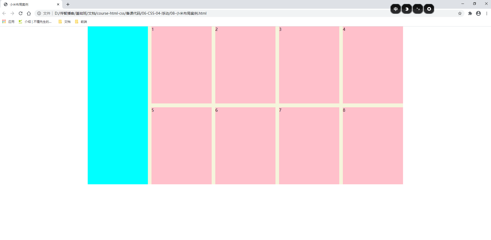
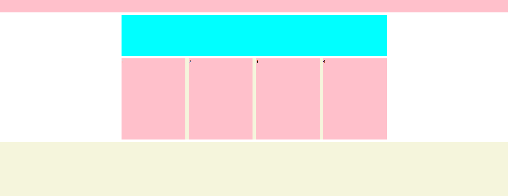

# CSS 第四天

[之前的笔记](before.md)

## 昨日反馈
| 意见或建议                                                   |
| ------------------------------------------------------------ |
| 其实是不是先了解整个开发过程，每个部分、岗位要用代码实现什么，会让新入门的小伙伴降低一点对前端基础代码的压力。我一开始死磕 css 时也是死记和理解，后来看多了 UI 设计图知道分层设计效果，就没走理解步骤了，没逻辑写死的东西后面独立思考出来一次能记一年 |
| 万少万少，可以透露一下以后工作的大致内容吗                   |
| 等万少介绍rich woman                                         |
| 继续verygood！！！！                                         |
| 盒子的模型掌握的还不是很清楚，自己会加把劲吃牢这一块。写作业的时候代码还是比较凌乱不够简洁，应该是接触的新知识还没有吸收好所导致的，但是磕磕碰碰也能写出来，之后就是熟练度的问题了！ |

## 学习目标

1. 能够说出**浮动的应用场景**和**布局套路**，并应用浮动**完成常见网页布局**案例；
2. 能够说出**清除浮动**的原因，并知道 **4 种清除浮动**的方法，并**至少记忆一种**伪元素清除浮动的方法
3. 学成在线项目开展


## 浮动

 

### 传统网页布局的三大部分

1. 标准流 文档流 普通流 
   1. 块级元素 占一行 宽度 等于父元素的宽度 `margin:0 auto;`
   2. 行内元素 一行放多个  宽度和高度由内容撑开  不能设置宽度和高度
   3. 行内块 一行放多个 宽度和高度 由内容撑开 可以设置宽度和高度
2. 浮动
3. 定位 


## 浮动

### 作用

1. 提高我们布局的效率  

### 特性

1. 都会变成 行内块元素 特性 
   1. 宽度和高度 由内容撑开
   2. 可以设置宽度和高度
   3. 一行上可以有多个行内块元素 
2. **脱标 脱离标准流**   容易忽略 
   1. 容器没有了高度 
   2. 下面的那个容器 飘上来 
   3. 解决方案
      1. 自己再给父盒子添加高度
      2. **清除浮动**


### 清除浮动

> 让父盒子重新拥有子元素的高度 


1. 额外标签法 了解即可

   1. 在浮动的子元素后面 添加一个标签 该标签 添加上 `clear:both;` 
   2. 必须是块级元素

2. 给父盒子 添加 `overflow:hidden;`

   1. 有副作用 超出就截取! 
   2. 只是自己做联系使用的时候 图方便

3. 父元素添加伪元素 `:after`  不用背 ,直接拷贝即可 面试不会让你手敲代码的 蛋定 ! 

   ```css
       .clearfix {
         zoom: 1;
       }
   
       .clearfix:after {
         display: block;
         clear: both;
         visibility: hidden;
         height: 0;
         content: '';
       }
   ```

   

4. 双伪元素 也是给浮动的父元素添加 

   ```css
   .clearfix::before,
   .clearfix::after {
     content: '';
     display: table;
   }
   
   .clearfix::after {
     clear: both;
   }
   ```


## 案例

### 浮动案例一

这个大盒子先要实现在页面中 居中显示 



### 浮动案例二




## 学成在线

### 准备工作

1. 讲解过 `pxcook` 的简单使用

2. 演示过 设计稿 

3. 开始搭建项目的目录结构 

4. 搭建css 目录结构  `normalize.css` 

   ```css
     <!-- 1 Normalize.css 让不同的浏览器 在显示标签的时候 保证外观一致 -->
     <link rel="stylesheet" href="./css/normalize.css">
     <!-- 2  网站的公共的样式  -->
     <link rel="stylesheet" href="./css/common.css">
     <!-- 3 当前页面自己独有的样式文件 -->
     <link rel="stylesheet" href="./css/index.css">
   ```

   