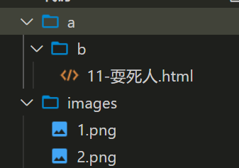
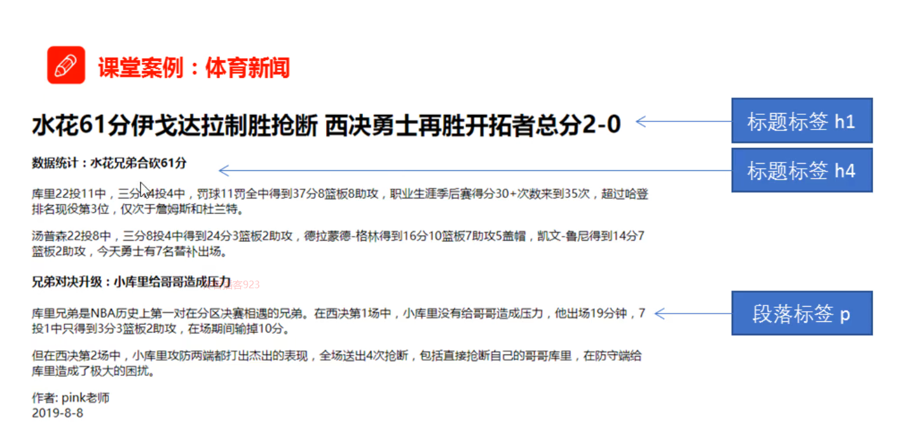
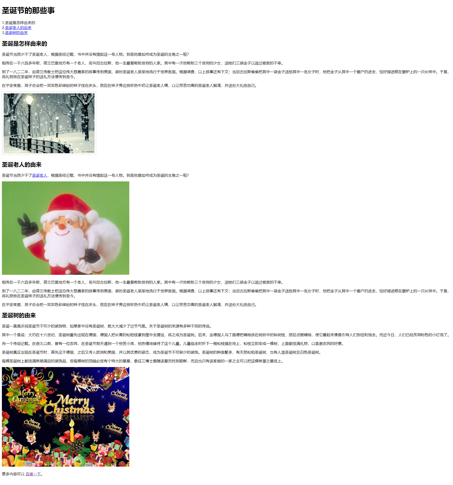

# 基础班

## 基础班完整的上课文档资料

- [内网可以打开](http://192.168.50.25:9077/)
- [外网可以打开](http://157.122.54.189:9077/)

## 上课的模式

1. 主要步骤播放 录制好的视频 
2. 我 万少 随时结合当下给大家做补充 !!! 
3. 万少所补充的重点和视频中 不太一样 
   1. 以 万少的为准!!! 

## 同学们需要做的事 

1. 上课 听课
2. 每一节课 都可以使用 typora 记录下来 重点难点 
3. 随时会有 作业 案例 去敲代码  
4. 晚自习
   1. 学会做一天的总结 (思维导图 xmind)
   2. 复习今天所学知识 +  案例
   3. 往下预习 明天即将要讲解的内容 
5. 在班级的时候 感觉到学习上有困难 自己很难去解决了  寻求别人的帮助 

## 基础班的学习目的

1. 基本目标 能够磕磕碰碰的把网页写完  
2. 更好的目标 熟练的把它写出来   (效率)
3. 精通  长期目标!!! 

# HTML 第一天

## 什么是网页

1. 网站  一堆网页的组成 
2. 网页 其实就是  HTML 文件 
3. HTML 
   1. 超文本标记语言 
   2. 组成元素
      1. 视频
      2. 图片
      3. 超链接
      4. 文字 

## 常用的浏览器内核 -  了解

| 浏览器         | 内核    | 备注                                     |
| -------------- | ------- | ---------------------------------------- |
| IE             | Trident | IE、猎豹安全、360 极速浏览器、百度浏览器 |
| FireFox        | Gecko   | 火狐浏览器内核                           |
| Safari         | Webkit  | 苹果浏览器内核                           |
| Chrome / Opera | Blink   | Blink 其实是 Webkit 的分支               |

## Web 标准

前端三大构成部分  

1. HTML 结构层
2. CSS 样式
3. JavaScript  行为

> 基础班只学习 HTML 和 CSS


## HTML 基本结构标签  (骨架)

补充的文档

```
http://192.168.50.25:9077/html/day01.html#%E2%98%862-html-%E9%AA%A8%E6%9E%B6
```


基本的结构

```html
<!DOCTYPE html>
<html lang="en">
<head>
  <title>Document</title>
</head>
<body>
  hello 
  你好 
</body>
</html> 
```

## 标签语义

[标签名和其含义](https://www.runoob.com/html/html-tag-name.html)

标签的含义  标签到底是做什么使用的

合适的地方存放合适的标签 

### 标题标签

`h1~h6` 标签  表示不同的标题

### 段落标签

`p`  标签

### 换行标签

`br`   它是一个单标签  意思是实现换行 

## 文本格式化标签

让文本显示粗体 倾斜 下划线等

> 能记住就能提高我们写代码的效率 不能记住就去翻阅文档  效率就低一些了

| 标签        | 说明                  |
| ----------- | --------------------- |
| strong 或 b | 加粗，更推荐 `strong` |
| em 或 i     | 倾斜，更推荐 `em`     |
| del 或 s    | 删除线，更推荐 `del`  |
| ins 或 u    | 下划线，更推荐 `ins`  |


### 以后开发 最常用的两个标签!!! 

1. div 标签  会换行(类似 p 标签)
2. span 标签   (不会换行)


## 换行和不换行的标签

### 换行

1. `br`
2. `p`
3. `div`  重要
4. `h1~h6`

### 不换行

1. `span`
2. `i`
3. `u`
4. `s`
5. `b`
6. `strong`
7. `em`
8. `del`
9. `ins`


## 图片标签

负责将一张图片显示在网页中 

1. `img`  图片标签 单标签
2. `src`  要存放图片的地址  
3. `alt`  当图片加载失败的时候 所显示的提示文字
4. `title` 当用户鼠标引入 图片的时候 显示文字

```html
  <!-- 
    1 src 负责填写要显示的图片的 路径-地址  必须要提供
    2 alt 负责给图片加提示使用了  看情况来添加吧 
        当图片显示失败 提示文字才出来 
    3 title  当用户的鼠标移入图片的时候 给别人的提示   看情况来添加吧 

    
   -->
  
  <span>柯南的电影</span>
  
```


### 相对路径和绝对路径

> 重点把握 相对路径即可 绝对路径-了解就可以了

```html
  <!-- 相对路径 -->
  
  <!-- 绝对路径  学习到了 服务器的知识  常用一些  -->
  
```

`在基础班 相对路径更加常用`





```html
  <!-- 
    1 需要先返回上一层
    2 再返回上一层
    3 就能找到 images 文件夹
    4 才能找到它里面的  1.png 

    5 相对路径
      1 是相对于网页自己的位置
      2 ../ 返回上一层的意思!!! 
    
   -->
   <!-- 1 返回上一层 -->
  
  <!-- 2 再返回上一层  返回两层 -->
  
  <!-- 3 就能找到 images 文件夹 -->
  
  <!-- 4 找到image下的图片 -->
  
  
```


## 链接标签

实现跳转功能

1. `a` 为标签名

2. `href`  为要跳转的地址 可以为外网链接 或者 内网链接 或者 `空链接 #`  或者 `锚点`

   1. 锚点

      ```html
      <a href="#ok">早点经历</a>
      
      <h1 id="ok" >
          刘德华的早点经历
      </h1>
      ```

      

3. `target`为打开方式 

   1. `_blank`  以新窗口打开
   2. `self` 将当前网页替换成 新的网页

4. `下载`   基础班少用  了解即可

5. 


## 锚点链接案例

给以下标题添加对应的锚点

```
1. 早年经历<br />
2. 演艺经历<br />
3. 个人生活<br />
4. 主要作品<br />
```


```
<h2>目录</h2>

1. 早年经历<br />
2. 演艺经历<br />
3. 个人生活<br />
4. 主要作品<br />

<h3>早年经历</h3>

刘德华出生于香港新界，在家中排行老四，幼时随家人搬到了九龙钻石山的木屋区居住，并和姐弟一起帮助家里打理卖稀饭的生意[17]
。1973年，刘德华随家人搬入香港蓝田邨第15座14楼[18]<br />
刘德华从黄大仙天主教小学毕业后升读可立中学[19]<br />
在可立中学读书期间，刘德华积极参加校内学校剧社的表演，在老师杜国威的指导下学习戏剧方面的知识。此外，他还参与包括编剧在内的幕后制作。刘德华在中五会考获得1B3D2E（中文读本A）的成绩。中六上学期后，他到香港电视广播有限公司的艺员训练班受训，从而开始了演艺之路[20]<br />

<h3>演艺经历</h3>

1981年，刘德华考进第10期无线电视艺员训练班[21]
；同年，出演个人首部电视剧《江湖再见》，在剧中饰演以贩卖妇女为生的小混混阿龙[22]
；该剧获得美国电视节电视剧特别奖[23] 。<br />
1982年，刘德华以甲级成绩从艺员训练班毕业后正式签约TVB[24]
；同年在喜剧《花艇小英雄》中饰演败家仔钱日添；12月，与叶德娴搭档主演时装警匪剧《猎鹰》，凭借卧底警察江大伟一角获得关注[25]
。<br />
1983年，主演金庸武侠剧《神雕侠侣》，在剧中饰演外貌俊俏、倜傥不羁的杨过[26]
；该剧在香港播出后取得62点的收视纪录；同年，与黄日华、梁朝伟、苗侨伟、汤镇业组成“无线五虎将”[27]
。<br />
1984年，与赵雅芝合作主演古装武侠剧《魔域桃源》，在剧中饰演资质出众、武功高强的傅青云[28]
；同年，与梁朝伟共同主演金庸武侠剧《鹿鼎记》，在剧中饰演英明果断的康熙[29]
。<br />
1985年，在古装武侠剧《杨家将》中饰演饶勇善战的杨六郎[30]
；同年，TVB向刘德华提出加签五年的合约，刘德华因拒绝而被TVB雪藏400天[31-32]。<br />
1986年，在邵逸夫的调解下，刘德华与TVB和解并签下合约；同年，主演古装剧《真命天子》。1988年，在出演了武侠剧《天狼劫》后，刘德华将演艺事业的重心转向影坛[32]
。<br />

<h3>个人生活</h3>

刘德华的父亲刘礼在启德机场做过消防员的工作。20世纪60年代，刘礼开了一间小吃杂货店以赚钱维持家用。刘德华在家中还有三位姐姐，一位妹妹以及一位弟弟（刘德盛）[158]
。<br />

<h3>感情</h3>

1986年，刘德华随香港明星足球队赴吉隆坡时，结识了朱丽倩。2008年6月23日，刘德华与朱丽倩在美国拉斯维加斯注册结婚[159]
。2012年5月9日，刘德华的妻子朱丽倩生下一个女儿。[160-161]<br />
2016年3月，刘德华的妻子朱丽倩怀上第2胎。[162]<br />
```


## 体育新闻案例

目标



文字素材

```
水花61分伊戈达拉制胜抢断 西决勇士再胜开拓者总分2-0
数据统计：水花兄弟合砍61分
库里22投11中，三分14投4中，罚球11罚全中得到37分8篮板8助攻，职业生涯季后赛得分30+次数来到35次，超过哈登排名现役第3位，仅次于詹姆斯和杜兰特。

汤普森22投8中，三分8投4中得到24分3篮板2助攻，德拉蒙德-格林得到16分10篮板7助攻5盖帽，凯文-鲁尼得到14分7篮板2助攻，今天勇士有7名替补出场。

兄弟对决升级：小库里给哥哥造成压力
库里兄弟是NBA历史上第一对在分区决赛相遇的兄弟。在西决第1场中，小库里没有给哥哥造成压力，他出场19分钟，7投1中只得到3分3篮板2助攻，在场期间输掉10分。

但在西决第2场中，小库里攻防两端都打出杰出的表现，全场送出4次抢断，包括直接抢断自己的哥哥库里，在防守端给库里造成了极大的困扰。

作者: 你的名字
2020-9-13
```

## 圣诞老人



