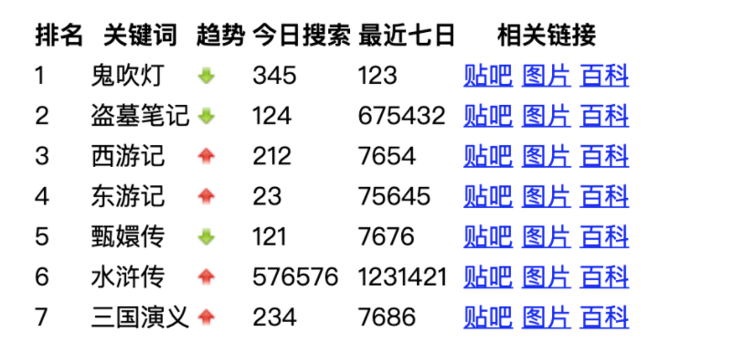
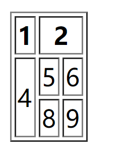
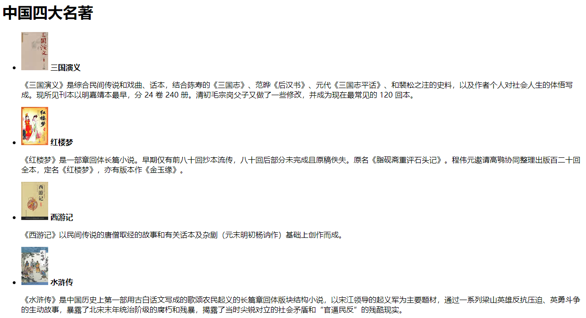
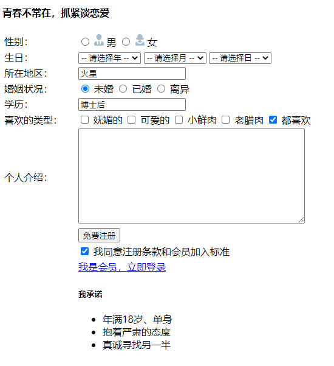

# HTML 第二天

[之前的链接](before.md)

## 昨日反馈

| 意见或建议                                           |
| ---------------------------------------------------- |
| 这个老师非常棒！！！                                 |
| 状态良好，verygood！                                 |
| 老师讲课的时候可以把快捷键也说一下下，嘻嘻~ 麻烦老师 |

## 今日学习目标

1. 能够使用**表格标签及属性**实现表格类结构的搭建，如**个人简历**；
2. 能够使用**三种列表**标签实现列表类结构的搭建，如**技能列表**、**网站底部导航**；
3. 能够使用**表单及输入项**实现表单类结构的搭建，如**注册或登录表单**。


## 表格

1. 作用

   1. 显示数据

2. 代码如何编写 简单表格

   ```html
      <table>
        <!-- 1  行 -->
        <tr>
          <th>编号</th> <th>年龄</th> <th>姓名</th>
        </tr>
        <!-- 2 行 -->
        <tr>
         <td>1</td> <td>16</td> <td>明星</td>
        </tr>
        <tr>
         <td>2</td> <td>16</td> <td>明星</td>
        </tr>
      </table>
   ```


### 表格属性

后期不用这个 现在就当作了解一下  我们照着文档去操作 试试 体验一下即可 

| 属性名      | 属性值                    | 描述                              |
| ----------- | ------------------------- | --------------------------------- |
| align       | `left`、`center`、`right` | 对齐方式                          |
| border      | **宽度像素值**或 ""       | 表格边框，默认 "" 无边框          |
| width       | 像素值                    | 宽度                              |
| height      | 像素值                    | 高度                              |
| cellspacing | 像素值                    | 单元格之间的间距，默认 2 像素     |
| cellpadding | 像素值                    | 内容与边框之间的距离，默认 1 像素 |


### 表格小说案例



```
http://192.168.50.25:9077/html/day02.html#_1-4-%E5%B0%8F%E8%AF%B4%E6%8E%92%E8%A1%8C%E6%A6%9C%E6%A1%88%E4%BE%8B
```


### 表格标准写法 都是这个结构 重要

1. `table`
   1. `thead`
      1. `tr`
         1. `th`
   2. `tbody`
      1. `tr`
         1. `td`

```html
  <table>
    <!-- 表头 -->
    <thead>
      <tr>
        <th>编号</th>
        <th>性别</th>
      </tr>
    </thead>
    <!-- 内容 -->
    <tbody>
      <tr>
        <td>1</td>
        <td>女</td>
      </tr>
    </tbody>
  </table>
```


### 表格合并

1. 列合并 `colspan`
2. 行合并 `rowspan`


选择左或者上 做为目标单元格 多余的要删除



```html
  <table border="1" >
    <thead>
      <tr>
        <th>1</th>
        <th colspan="2" >2</th>
      </tr>
    </thead>
    <tbody>
      <tr>
        <td rowspan="2" >4</td>
        <td>5</td>
        <td>6</td>
      </tr>
      <tr>
        <td>8</td>
        <td>9</td>
      </tr>
    </tbody>
  </table>
```


## 列表标签

1. 有序列表
2. 无序列表  `ul` 最常用
3. 自定义列表 

### 有序 和 无序 列表

```html
  <!-- 有序列表 order list  -->
  <ol>
    <li>羊</li>
    <li>🐖</li>
    <li>🐵</li>
  </ol>

  <!-- 无序  unorder list -->
  <ul>
    <li>红色</li>
    <li>蓝色</li>
    <li>绿色</li>
  </ul>
```

### 自定义列表

```html
<dl>
    <dt>颜色分类</dt>
    <dd>红</dd>
    <dd>绿</dd>
    <dd>蓝</dd>
</dl>
```


## 表单

让用户填写信息的标签

以后再学到 js 和 服务器知识的时候会再次重点讲解

后期都会使用 自己或者别人修改过的 表单标签 因为 修改后更加好看 我们统称为 UI框架


### 表单域

就是一个 `form` 标签  什么 action methods url 暂时忽略 不用


### 输入标签

### type 属性值

```html
<input type="text" />
```

**以下 红色的为常用的! **

| 值             | 描述                                                         |
| :------------- | :----------------------------------------------------------- |
| `button`       | 定义可点击的按钮（通常与 JavaScript 一起使用来启动脚本）。  通过value 来修改按钮的文本 |
| `checkbox`     | 定义复选框。                                                 |
| color          | 定义拾色器。                                                 |
| date           | 定义 date 控件（包括年、月、日，不包括时间）。               |
| datetime       | 定义 date 和 time 控件（包括年、月、日、时、分、秒、几分之一秒，基于 UTC 时区）。 |
| datetime-local | 定义 date 和 time 控件（包括年、月、日、时、分、秒、几分之一秒，不带时区）。 |
| email          | 定义用于 e-mail 地址的字段。                                 |
| `file`         | 定义文件选择字段和 "浏览..." 按钮，供文件上传。              |
| hidden         | 定义隐藏输入字段。                                           |
| image          | 定义图像作为提交按钮。                                       |
| month          | 定义 month 和 year 控件（不带时区）。                        |
| number         | 定义用于输入数字的字段。                                     |
| `password`     | 定义密码字段（字段中的字符会被遮蔽）。                       |
| `radio`        | 定义单选按钮。                                               |
| range          | 定义用于精确值不重要的输入数字的控件（比如 slider 控件）。   |
| `reset`        | 定义重置按钮（重置所有的表单值为默认值）。                   |
| search         | 定义用于输入搜索字符串的文本字段。                           |
| `submit`       | 定义提交按钮。  可以搭配 value 来修改按钮的文本              |
| tel            | 定义用于输入电话号码的字段。                                 |
| `text`         | 默认。定义一个单行的文本字段（默认宽度为 20 个字符）。       |
| time           | 定义用于输入时间的控件（不带时区）。                         |
| url            | 定义用于输入 URL 的字段。                                    |
| week           | 定义 week 和 year 控件（不带时区）。                         |


以下是比较常用的 `type` 类型  具体的使用说明 最好结合上述的表格来理解学习 

1. text
2. password
3. radio
4. checkbox
5. submit  提交 配合后台一起使用 先忽略
6. reset  重置表单 
7. button 常用 按钮 普通  
8. file   上传文件 

### name属性 

> 任意的表单标签 都可以添加 name属性

给 同一样的一组 radio 提供 name 属性  可以实现单选效果 

### value  表单的值

> 任意的表单标签 都可以添加 value属性

规定 表单的值

### checked  选中

> 只能给  radio 和 checkbox 使用  其他没有意义 

表示选中的意思

### 代码 1

```html
  <!-- 
    需要使用到 表单 注册页面 或者 登录页面
    1 表单域 form
    2 type 
      1 text 文本输入框
      2 password 密码 
    2 value
      1 意思是将发送给后台的 值 
    3 placeholder
      1 最适合和输入框 搭配 占位符
    4 name
      给每一个表单标签 的名字 
      给 单选框添加 否则无法实现 单选效果!!! 
    5 checked 
      1 单选框和复选框 添加 默认的选中 
   -->
  <form>
    <div>
      你的对象的名称 : <input type="text" value="请输入内容">
    </div>
    <div>
      你的宠物的名称 : <input type="text" placeholder="请输入内容">
    </div>
    <div>
      你喜欢 白天还是黑夜 :  
      白天 <input type="radio"  name="se">
      黑夜 <input type="radio" checked name="se">
    </div>
    <div>
      今晚要不要请吃夜宵
      要 <input type="radio" name="eat">
      不想 但是也要  <input type="radio" name="eat">
    </div>
    <div>
      密码 <input type="password" placeholder="请输入密码" >
    </div>
    <div>
      用户勾选同意 :  
      <input type="checkbox" checked >
    </div>
  </form>
```


### label 标签

作用:

1. 显示提示信息
2. 增大用户的响应区域 

使用:

一般通过 `for` 属性搭配 `input` 标签的 `id` 使用 

### select 下拉框  元素

1. select	
2. option
3. selected  

```html
    <select >
      <option value="shanghai">上海</option>
      <option value="guangzhou"  selected >广州</option>
      <option value="shenzhen">深圳</option>
    </select>
```

### textarea  文本域 

填写大段的文本的时候用到的标签

```html
<textarea></textarea>
```

## 作业

### 四大名著  列表



```
中国四大名著
 三国演义
《三国演义》是综合民间传说和戏曲、话本，结合陈寿的《三国志》、范晔《后汉书》、元代《三国志平话》、和裴松之注的史料，以及作者个人对社会人生的体悟写成。现所见刊本以明嘉靖本最早，分 24 卷 240 册。清初毛宗岗父子又做了一些修改，并成为现在最常见的 120 回本。

 红楼梦
《红楼梦》是一部章回体长篇小说。早期仅有前八十回抄本流传，八十回后部分未完成且原稿佚失。原名《脂砚斋重评石头记》。程伟元邀请高鹗协同整理出版百二十回全本，定名《红楼梦》，亦有版本作《金玉缘》。

 西游记
《西游记》以民间传说的唐僧取经的故事和有关话本及杂剧（元末明初杨讷作）基础上创作而成。

 水浒传
《水浒传》是中国历史上第一部用古白话文写成的歌颂农民起义的长篇章回体版块结构小说，以宋江领导的起义军为主要题材，通过一系列梁山英雄反抗压迫、英勇斗争的生动故事，暴露了北宋末年统治阶级的腐朽和残暴，揭露了当时尖锐对立的社会矛盾和“官逼民反”的残酷现实。
```


### 个人简历  表格


### 个人信息  表格和表单 




